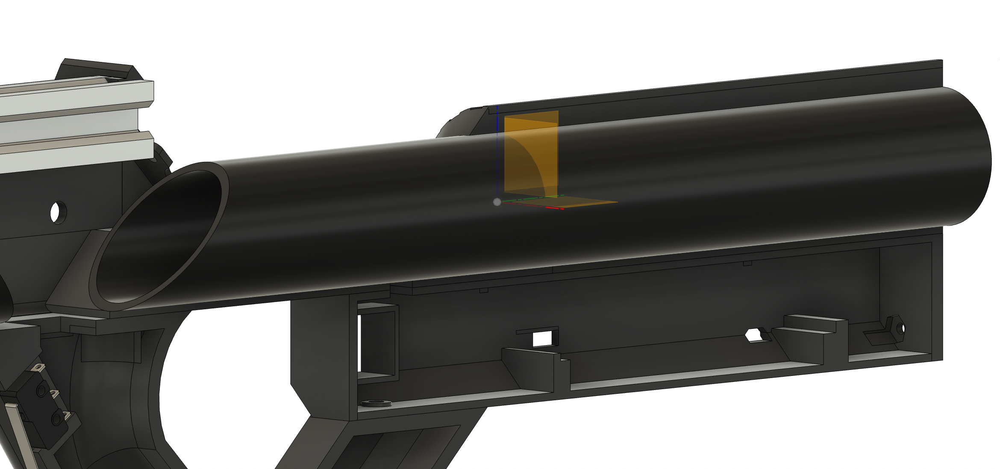

# Constructing the Laser Tagger

The laser tag can be printed on most 3D printers. General settings are:
- Layer Height: 2mm
- Infill: 20%

There have been good results printing with this [Matt Black PLA](https://www.amazon.co.uk/dp/B0B935NLMP?psc=1&ref=ppx_yo2ov_dt_b_product_details)

### General info

The tagger is designed to be printed in two halves. It uses a piece of PVC pipe to add some structual rigidity, and a 15cm piece of aluminium extrusion to help with joining the halves together, and also for mounting a picatinny rail.

Print one of each of the files in the latest version (./tagger/v5/...)

|Name|STL file| Supports Required|
|---|---|---|
|Lens Holder    |[Lens_Holder](https://raw.githubusercontent.com/NilSkilz/tag-os/main/tagger/v5/Lens_Holder.stl)|no|
|Barrel Front   | [Barrel_Front_A](https://raw.githubusercontent.com/NilSkilz/tag-os/main/tagger/v5/Barrel_Front_A.stl)   [Barrel_Front_B](https://raw.githubusercontent.com/NilSkilz/tag-os/main/tagger/v5/Barrel_Front_B.stl)|yes|
|Barrel Rear   | [Barrel_Rear_A](https://raw.githubusercontent.com/NilSkilz/tag-os/main/tagger/v5/Barrel_Rear_A.stl)   [Barrel_Rear_B](https://raw.githubusercontent.com/NilSkilz/tag-os/main/tagger/v5/Barrel_Rear_B.stl)|yes|
|Screen   |[Screen_Front](https://raw.githubusercontent.com/NilSkilz/tag-os/main/tagger/v5/Screen_Front.stl)   [Screen_Rear](https://raw.githubusercontent.com/NilSkilz/tag-os/main/tagger/v5/Screen_Rear.stl)|no|
|Grip   |[Grip_A](https://raw.githubusercontent.com/NilSkilz/tag-os/main/tagger/v5/Grip_A.stl)   [Grip_B](https://raw.githubusercontent.com/NilSkilz/tag-os/main/tagger/v5/Grip_B.stl)|no|
|Handle   |[Handle_A](https://raw.githubusercontent.com/NilSkilz/tag-os/main/tagger/v5/Handle_A.stl)   [Handle_B](https://raw.githubusercontent.com/NilSkilz/tag-os/main/tagger/v5/Handle_B.stl)|no|
|Upper Stock Front   |[Upper_Stock_Rear_A](https://raw.githubusercontent.com/NilSkilz/tag-os/main/tagger/v5/Upper_Stock_Rear_A.stl)   [Upper_Stock_Rear_B](https://raw.githubusercontent.com/NilSkilz/tag-os/main/tagger/v5/Upper_Stock_Rear_B.stl)|yes|
|Upper Stock Rear  |[Upper_Stock_Rear_A](https://raw.githubusercontent.com/NilSkilz/tag-os/main/tagger/v5/Upper_Stock_Rear_A.stl)   [Upper_Stock_Rear_B](https://raw.githubusercontent.com/NilSkilz/tag-os/main/tagger/v5/Upper_Stock_Rear_B.stl)|no|
|Rear Stock   |[Rear_Stock](https://raw.githubusercontent.com/NilSkilz/tag-os/main/tagger/v5/Rear_Stock.stl)|no|

### Lens Holder
Attach an LED holder through the small hole at the bottom. The 33mm lens should clip nicely into the top. The lens should be orienteted xxxx

### Barrel
The front and rear barrels should be joined with a 40mm M3 bolt. Slide a M3 nut into the recess and secure the bolt.

### Grip and Handle
These are secured together with an M4 bolt. The lower stock is then attached via a second bolt. 

### Upper Stock
The rear and front upper stock are joined with a M4 8mm bolt and nut. This can then be attached to the lower stock using two bolts.
Attach the stock and grip to the barrel with two more bolts.

### Aluminium extrusion
Attach the barrel to the 15cm aluminium extrusion using M3 bolts and T-nuts. 

### PVC pipe
Cut a length of PVC pipe, roughly 26cm, at a 45° angle. This fits into the rear stock. You'll also need to cut a hole in the pipe, at the opening in the front rear stock, to allow a few cables to go through.

Once all the electronics are installed, you can attach the two sides together using an M3 bolt through the grip. You can then attach the screen housing to the body (this can be fiddly) using M3 bolts.